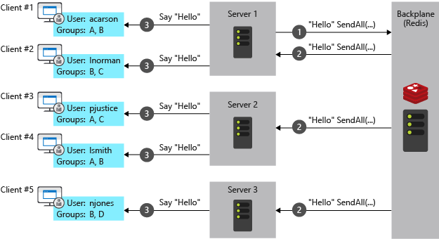

# Blazor Server SignalR Demo

<!-- TOC -->
* [Blazor Server SignalR Demo](#blazor-server-signalr-demo)
  * [Goal](#goal)
  * [Background](#background)
    * [Blazor](#blazor)
    * [Blazor Hosting Models](#blazor-hosting-models)
      * [Blazor Server](#blazor-server)
      * [Blazor WebAssembly](#blazor-webassembly)
      * [Blazor Hybrid](#blazor-hybrid)
    * [Render Modes](#render-modes)
      * [Prerendering](#prerendering)
  * [Getting Started](#getting-started)
  * [Application Breakdown](#application-breakdown)
  * [Blazor - SignalR Guidance](#blazor---signalr-guidance)
  * [SignalR Redis Backplane](#signalr-redis-backplane)
<!-- TOC -->

## Goal

Provide an example of SignalR usage in a Blazor Server application. This is a practical example to supplement the official 
documentation found [here](https://learn.microsoft.com/en-us/aspnet/core/blazor/fundamentals/signalr?view=aspnetcore-8.0).

## Background

### Blazor

Blazor is a framework for building interactive client-side web UI with .NET. It supports both server-side and client-side rendering in a single
programming model.

Blazor applications are based on a _component model_ whereby each page is comprised of multiple nested components. This is similar to frameworks 
such as React and Angular.

### Blazor Hosting Models

Blazor supports three hosting models in .NET 8. 

#### Blazor Server

With the Blazor Server hosting model, components are executed on the server from within an ASP.NET Core app. 
UI updates, event handling, and JavaScript calls are handled over a SignalR connection using the WebSockets protocol.

Each session (window or tab) has a dedicated SignalR connection to the server. This results in higher server resource usage compared to 
other hosting models.


The Blazor Server hosting model offers several benefits:

- Download size is significantly smaller than when the Blazor WebAssembly hosting model is used, and the app loads much faster.
- The app takes full advantage of server capabilities, including the use of .NET Core APIs.
- .NET Core on the server is used to run the app, so existing .NET tooling, such as debugging, works as expected.
- Thin clients are supported. For example, Blazor Server works with browsers that don't support WebAssembly and on resource-constrained devices.
- The app's .NET/C# code base, including the app's component code, isn't served to clients.

The Blazor Server hosting model has the following limitations:

- Higher latency usually exists. Every user interaction involves a network hop.
- There's no offline support. If the client connection fails, interactivity fails.
- Scaling apps with many users requires server resources to handle multiple client connections and client state.
- Serverless deployment scenarios aren't possible, such as serving the app from a Content Delivery Network (CDN).

#### Blazor WebAssembly

With the Blazor WebAssembly hosting model, the app's .NET code runs in the browser using a WebAssembly-based .NET runtime. Assets are deployed
to clients as static files, and the app is executed directly in the browser.


The Blazor WebAssembly hosting model offers several benefits:

- For standalone Blazor WebAssembly apps, there's no .NET server-side dependency after the app is downloaded from the server, so the app remains functional if the server goes offline.
- Client resources and capabilities are fully leveraged.
- Work is offloaded from the server to the client.
- For standalone Blazor WebAssembly apps, an ASP.NET Core web server isn't required to host the app. Serverless deployment scenarios are possible, such as serving the app from a Content Delivery Network (CDN).

The Blazor WebAssembly hosting model has the following limitations:

- Razor components are restricted to the capabilities of the browser.
- Capable client hardware and software (for example, WebAssembly support) is required.
- Download size is larger, and components take longer to load.
- Code sent to the client can't be protected from inspection and tampering by users.

#### Blazor Hybrid

Blazor hybrid allows Blazor to be used to build native client applications. Hybrid applications are native apps that execute razor 
components in an embedded web view.

Blazor hybrid applications can be built using multiple native frameworks, including .NET MAUI, WPF, and Windows Forms. These applications have access
to native platform capabilities through normal .NET APIs.


The Blazor Hybrid hosting model offers several benefits:

- Reuse existing components that can be shared across mobile, desktop, and web.
- Leverage web development skills, experience, and resources.
- Apps have full access to the native capabilities of the device.

The Blazor Hybrid hosting model has the following limitations:

- Separate native client apps must be built, deployed, and maintained for each target platform.
- Native client apps usually take longer to find, download, and install over accessing a web app in a browser.

### Render Modes

Every component in a Blazor application adopts a _render mode_ to determine where it's rendered, and whether or nor it's interactive. 
None of this applies to Blazor WebAssembly, though, as all components there are rendered client side.

| Name                    | Description                                                                                                                | Render Location     | Interactive |
|-------------------------|----------------------------------------------------------------------------------------------------------------------------|---------------------|-------------|
| Static Server           | Static server-side rendering (SSR).                                                                                        | Server              | &#10060;    |
| Interactive Server      | Interactive SSR using Blazor Server.                                                                                       | Server              | &#10003;    |
| Interactive WebAssembly | Client-side rendering (CSR) using Blazor WebAssembly.                                                                      | Client              | &#10003;    |
| Interactive Auto        | Interactive SSR using Blazor Server initially and then CSR on subsequent visits<br/>after the Blazor bundle is downloaded. | Server, then Client | &#10003;    |

#### Prerendering

Prerendering is the process of initially rendering page content on the server without enabling event handlers for rendered controls 
to improve page load speed.

## Getting Started

1. Clone the repository
2. Restore packages `dotnet restore ./Signalr.Demo`
3. Run the solution `dotnet run --project ./Signalr.Demo/Signalr.Demo/Signalr.Demo.csproj`
4. Navigate to http://localhost:5203 in your browser

## Application Breakdown

This application is a copy of the default Blazor Server application with the addition of a SignalR hub and client. Let's dig into the changes
I have made further:

1. Added SignalR hub options to the default service registration:

```csharp
builder.Services.AddRazorComponents()
    .AddInteractiveServerComponents()
    .AddHubOptions(options =>
    {
        options.ClientTimeoutInterval = TimeSpan.FromSeconds(60);
        options.HandshakeTimeout = TimeSpan.FromSeconds(30);
        options.MaximumReceiveMessageSize = 64 * 1024;
    });
```

2. Added Redis as a SignalR backplane to support scaling out the application:

```shell
dotnet add package Microsoft.AspNetCore.SignalR.StackExchangeRedis
```

```csharp
builder.Services.AddSignalR()
    .AddStackExchangeRedis("localhost", o =>
    {
        o.ConnectionFactory = async writer =>
        {
            var config = new ConfigurationOptions
            {
                AbortOnConnectFail = false
            };
            config.EndPoints.Add(IPAddress.Loopback, 0);
            config.SetDefaultPorts();
            var connection = await ConnectionMultiplexer.ConnectAsync(config, writer);
            connection.ConnectionFailed += (_, e) =>
            {
                Console.WriteLine("Connection to Redis failed.");
            };

            if (!connection.IsConnected)
            {
                Console.WriteLine("Did not connect to Redis.");
            }

            return connection;
        };
    });
```

3. Configured automatic client reconnection in the `App.razor` file as in [Blazor - SignalR Guidance](#blazor---signalr-guidance).

## Blazor - SignalR Guidance

For Blazor Server applications tweaks are recommended to the default SignalR configuration to ensure the best performance.

1. Enable _sticky sessions_ on the load balancer to ensure that all SignalR connections from a client are routed to the same server.
2. Use _response compression_ to reduce the size of the SignalR messages.

```csharp
if (!app.Environment.IsDevelopment())
{
    app.UseResponseCompression();
}
```

3. Increase the maximum receive message size to better support large pre-rendered pages (note, too large a value can lead to denial-of-service issues.) The default is 32KB, 64KB is recommended.

```csharp
builder.Services.AddRazorComponents().AddInteractiveServerComponents()
    .AddHubOptions(options => options.MaximumReceiveMessageSize = 64 * 1024);
```

4. Improve the connection loss UI by adding a reconnect modal. This can be done by adding the following code to your `App.razor` file and CSS file.
This will display a modal when the connection is lost and attempt to reconnect. The modal will display the current attempt and the maximum number of retries.
The modal will be hidden when the connection is re-established or the maximum number of retries is reached.

```csharp
/* Add to your App.razor file */

<div id="components-reconnect-modal">
    There was a problem with the connection!
    (Current reconnect attempt: 
    <span id="components-reconnect-current-attempt"></span> /
    <span id="components-reconnect-max-retries"></span>)
</div>
```

```css
/* Add to your CSS file */

#components-reconnect-modal {
  display: none;
  transition: visibility 0s linear 1000ms;
}

#components-reconnect-modal.components-reconnect-show,
#components-reconnect-modal.components-reconnect-failed,
#components-reconnect-modal.components-reconnect-rejected {
  display: block;
}
```

5. Automatically reconnect SignalR connections when they are lost (this is an alternative to #4). This can be done by adding the following code to your `App.razor` file.

```csharp
<div id="reconnect-modal" style="display: none;"></div>
<script src="{BLAZOR SCRIPT}" autostart="false"></script>
<script src="boot.js"></script>
```

Create the following `boot.js` file in the `wwwroot` folder.

```javascript
(() => {
  const maximumRetryCount = 3;
  const retryIntervalMilliseconds = 5000;
  const reconnectModal = document.getElementById('reconnect-modal');

  const startReconnectionProcess = () => {
    reconnectModal.style.display = 'block';

    let isCanceled = false;

    (async () => {
      for (let i = 0; i < maximumRetryCount; i++) {
        reconnectModal.innerText = `Attempting to reconnect: ${i + 1} of ${maximumRetryCount}`;

        await new Promise(resolve => setTimeout(resolve, retryIntervalMilliseconds));

        if (isCanceled) {
          return;
        }

        try {
          const result = await Blazor.reconnect();
          if (!result) {
            // The server was reached, but the connection was rejected; reload the page.
            location.reload();
            return;
          }

          // Successfully reconnected to the server.
          return;
        } catch {
          // Didn't reach the server; try again.
        }
      }

      // Retried too many times; reload the page.
      location.reload();
    })();

    return {
      cancel: () => {
        isCanceled = true;
        reconnectModal.style.display = 'none';
      },
    };
  };

  let currentReconnectionProcess = null;

  Blazor.start({
    circuit: {
      reconnectionHandler: {
        onConnectionDown: () => currentReconnectionProcess ??= startReconnectionProcess(),
        onConnectionUp: () => {
          currentReconnectionProcess?.cancel();
          currentReconnectionProcess = null;
        }
      }
    }
  });
})();
```

## SignalR Redis Backplane

To use Redis as a backplane for SignalR, you need to install the `Microsoft.AspNetCore.SignalR.StackExchangeRedis` package.

```shell
dotnet add package Microsoft.AspNetCore.SignalR.StackExchangeRedis
```

Redis is not required for a standard Blazor Server application. It is only necessary if you wish to broadcast messages between multiple 
client connections that may be connected to multiple servers.


